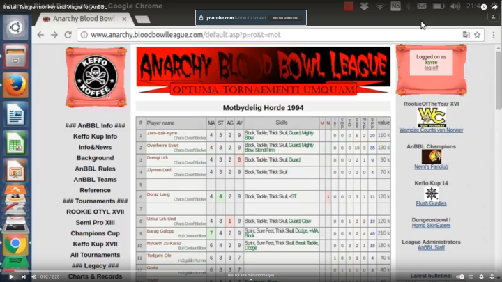

# Viagra_for_Anarchy_Blood_Bowl_League
Convert onclick to anchor for bloodbowlleague.com

Client side javascript for use with browser extensions Tampermonkey or Greasemonkey.

Dette er et Nettlesertillegg script som gjør anbbl litt enklere å navigere og gjør noen andre forbedringer. 
Funksjoner
 * Alle (de fleste) link lar seg åpne i ny fane og kopiere.
 * Direkte tilgang til kamplista for turneringen i venstremenyen.
 * Direkte tilgang til å opprette nye kamper for semipro i venstremenyen.
 * Tekstboks for å filtrere lista i "Add match(es) to".
 * Tekstboks for å filtrere spillerlista for nye bounties (600+ spillere).
 * Team rostere får rad for sum og gjennomsnitt nederst. Viser feks. antall spillere klare til kamp.
 * extra skills i team rosteren er klikkbar og gir liste over ferdigheter med antall.
 * Team roster får Show SPP details link, som viser int, cmp, td, cas, mvp per spiller og sum.

For å kjøre skriptet trenger du tillegget Tamper Monkey installert. https://www.tampermonkey.net/

Deretter finner man skriptet ved å besøke https://openuserjs.org/scripts/ketilkn/Viagra_for_Anarchy_Blood_Bowl_League

Primært for datamaskiner. Fungerer på Android med Firefox og andre nettlesere som har Tamper Monkey tilgjenglig.

## Features

### Improved team roster
https://github.com/ketilkn/Tamper_for_Anarchy_Blood_Bowl_League/assets/26262735/02515d49-c76e-47a3-bd08-2cf944a928d0

### Add match team filter
https://github.com/ketilkn/Tamper_for_Anarchy_Blood_Bowl_League/assets/26262735/1cffa7c0-385e-41d0-bfdd-0f1b0837ef6f

### Set bounty
https://github.com/ketilkn/Tamper_for_Anarchy_Blood_Bowl_League/assets/26262735/fa9259ab-7a49-4bd7-8a7f-d16f3559345d

### Install (old)

